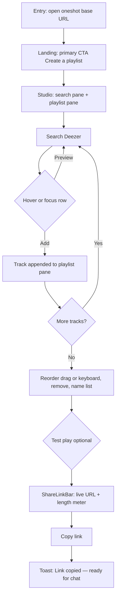
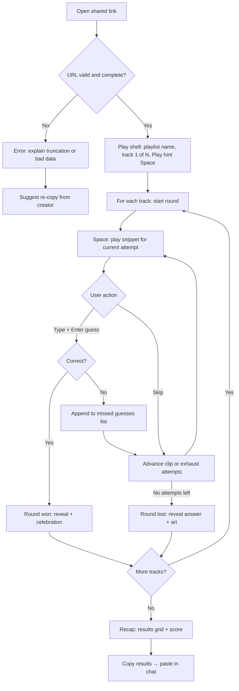
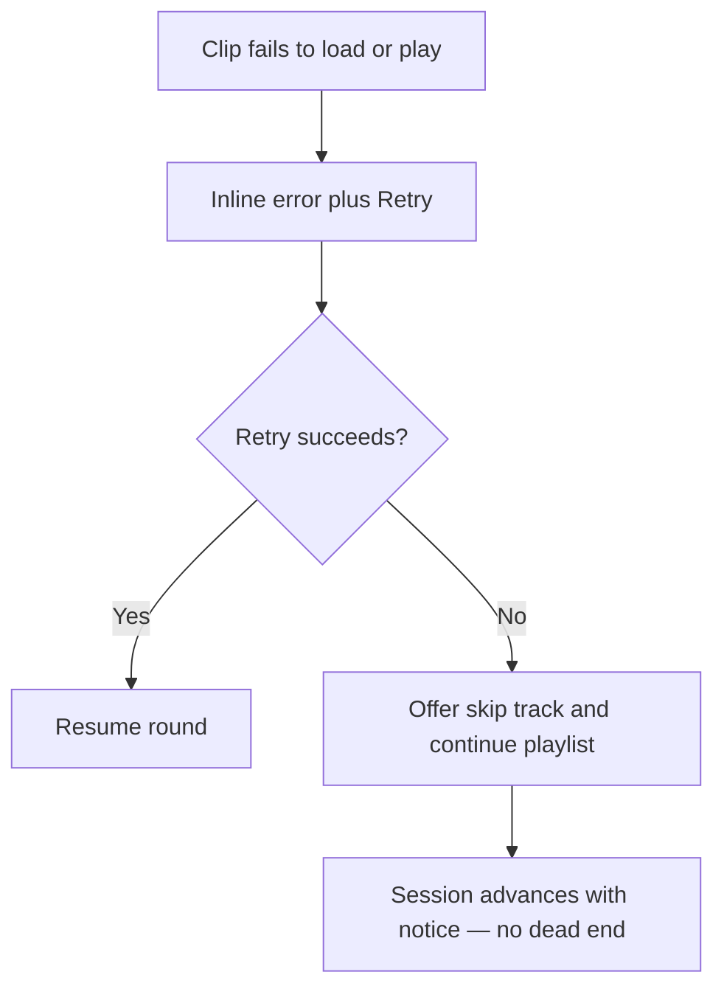
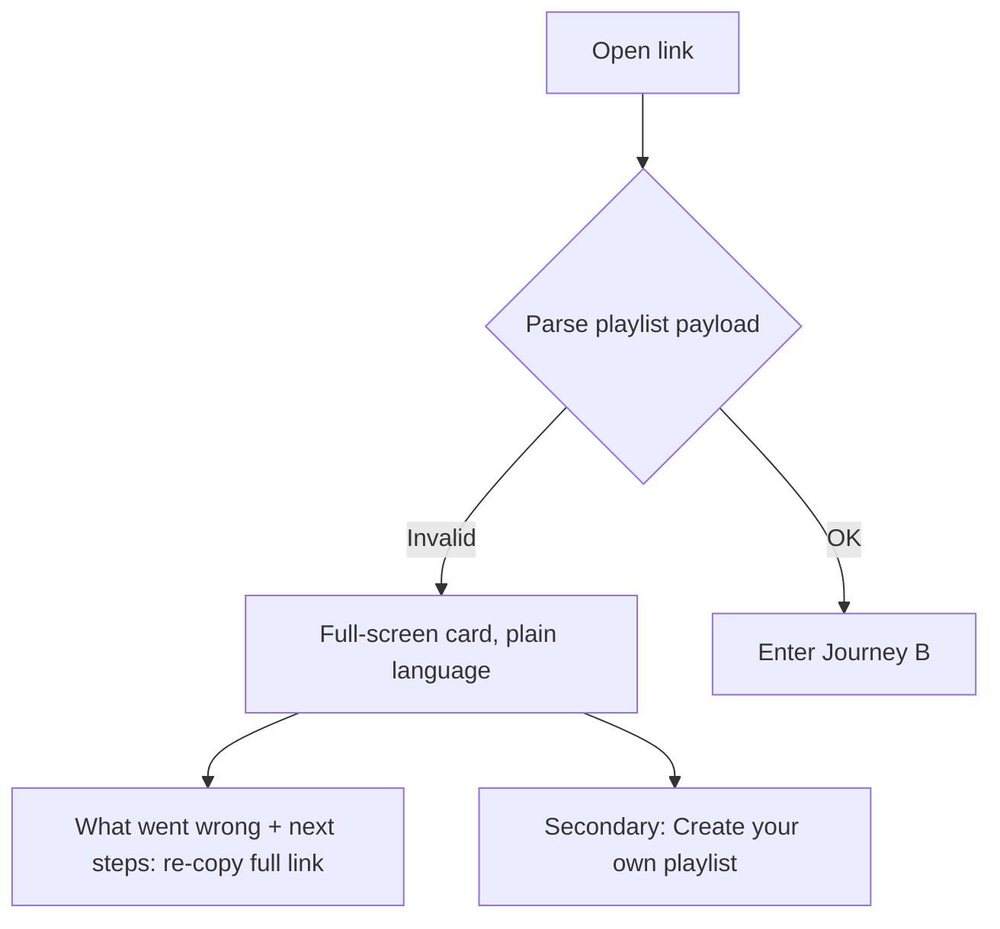

---
stepsCompleted:
  - 1
  - 2
  - 3
  - 4
  - 5
  - 6
  - 7
  - 8
  - 9
  - 10
  - 11
  - 12
  - 13
  - 14
lastStep: 14
uxDesignWorkflowCompleted: "2026-06-10"
inputDocuments:
  - _bmad-output/planning-artifacts/prd.md
---

# UX Design Specification oneshot

**Author:** Ryan
**Date:** June 10, 2026

---

## Executive Summary

### Project Vision

Deliver a **frictionless, desktop-first** music guessing experience: **user-built Deezer playlists** become **shareable games**—each track is a **classic Heardle round** (progressive clips, six attempts, skip, catalog autocomplete)—with **no accounts** and **no music login**, so **one link** is enough to play in a real group chat, and **one paste** (the emoji recap) is enough to share the result back.

Two surfaces define the product:

1. **Creator Studio** — a two-pane workspace where building a game feels like building a playlist in a real music app: search left, playlist right, instant preview, drag to reorder, live share link.
2. **Play shell** — a calm, centered game column where audio is the hero and the entire round loop runs on the keyboard.

### Target Users

- **Playlist creators** curate tracks for friends at a desk (often while chatting in another window), **preview** candidates instantly, **reorder** by drag, **test-play**, and **copy a URL**—all without signing up.
- **Players** open a **shared link** on a laptop/desktop, understand **round rules** in seconds, run the **playlist** mostly on the keyboard with **clear feedback**, and **copy their recap** to paste back into chat.

### Key Design Challenges

- Use desktop space **without clutter**: a wide viewport invites noise; play mode must stay a **single focused column** while the studio earns its **two panes**.
- Make **autocomplete selection** fast and **accessible** (keyboard, screen readers) under **variable latency**.
- Make **keyboard shortcuts discoverable** without a tutorial wall (on-screen hints, `?` overlay).
- Design **trustworthy error paths** for **bad URLs** and **audio failures** (retry, skip track, plain language)—never **silent** failure.

### Design Opportunities

- **Immediate value**: Land users in **create** or **play** without gates; reinforce **"your playlist, your people"** in copy and hierarchy.
- **Root landing page**: Visitors who open the **app base URL** get a **simple, modern, clean** landing with a **primary CTA** to **create a playlist**, plus a quiet "how it works" strip. No auth walls, no marketing bloat.
- **Hover as a superpower**: Desktop pointers enable **preview-on-hover**, row-level actions revealed on hover, and rich tooltips—always with click/keyboard equivalents.
- **The recap as a social artifact**: The end-of-run screen is designed to be **screenshot-able and copy-able**—the emoji grid is the product's organic growth loop.
- **Visual tone**: **Simple**, **modern**, **clean**—restrained chrome, clear hierarchy, generous spacing; dark-first so album art and the gradient progress bar pop.

## Core User Experience

### Defining Experience

1. **Play loop (recipient):** Enter from a **URL** → for each track, **press Space, hear progressive clips**, manage a **six-attempt budget**, use **skip** or **autocomplete guess**, get **immediate round feedback**, then **advance through the playlist** → **recap + copy results**.
2. **Create loop (creator):** **Search Deezer** in the left pane, **hover-preview**, **add**, **drag to order** in the right pane, **test-play**, then **copy one URL** that *is* the game.

**One line:** **Your playlist is the puzzle; one link carries the whole session—no accounts; one paste carries the score back.**

### Platform Strategy

- **Desktop web app** (SPA), **pointer + keyboard optimized**; P0 browsers are desktop **Chrome, Firefox, Safari, Edge** (current −1). Tablet adapts; mobile is best-effort (play flow usable single-column).
- **HTTPS** via GitHub Pages; **audio** and **Deezer API** are **online** dependencies—surface **loading** and **errors** instead of silent stalls.
- **URL as playlist carrier:** Entry from **shared links** must **parse**, **validate**, and **hydrate** gameplay; invalid or truncated data gets a **dedicated error state** with plain-language recovery hints. Deep links must survive **full page reloads** on GitHub Pages.
- **Autoplay policies:** First audio always follows a **user gesture** (Space or click on Play); the play shell makes that gesture the obvious first action.

### Effortless Interactions

- **Landing (shared game link):** Recipient **never** sees auth; first meaningful screen is the **play shell** (playlist name, track 1 of N, a big Play affordance) or **clear failure** with next steps.
- **Landing (app root):** One **primary CTA**: **Create a playlist**. Single visual focus; no login; no competing primary buttons.
- **Round clarity:** **Attempt index / remaining attempts** and **clip stage** are always scannable; **skip** and **wrong guess** both **consume one attempt** and **advance audio** with non-ambiguous feedback.
- **Guessing:** **Combobox** is the **primary** input—auto-focused at round start, **debounced search**, ↑↓ to highlight, Enter to submit, Esc to clear. Tolerant of latency (inline status), easy to correct before submit.
- **Missed guesses:** Each **incorrect submitted pick** (title + artist) stays visible for the current track in a dedicated list—Heardle-style—so players never re-stumble on the same wrong song. Clears when the round advances. Muted styling (not error-red).
- **Keyboard map (play):** **Space** play/replay snippet · **any letter** focuses the guess box and starts typing · **Enter** submit highlighted suggestion · **Ctrl/Cmd+S or dedicated Skip button via Tab** skip · **Enter/→** next track after reveal · **?** shortcut overlay. All shortcuts have visible on-screen equivalents (NFR-A3).
- **Studio fluency:** Type → results in <1s → **hover row = preview play button**, click adds → track lands in right pane with a subtle slide-in. **Drag handle** or **↑/↓ buttons** (keyboard accessible) reorder. **Share bar** pinned at the bottom of the playlist pane updates live.
- **Sharing:** **Copy link** is one click with "Link copied ✓" confirmation; **URL length meter** warns transparently before limits.
- **Recap:** Per-track grid (attempt won on / ✗), score line ("7/10 — nailed 3 on the first second"), **Copy results** button producing an emoji grid + link.
- **Recovery:** **Retry** for failed audio; **skip track** for unavailable tracks—never a stuck spinner with no copy.

### Critical Success Moments

- **Link open → first audible clip** (or actionable error within seconds): proves **"no signup"** and technical trust.
- **First resolved round** (win or loss with reveal): validates Heardle loop comprehension and emotional payoff.
- **Creator copies shareable URL** after a fluent two-minute build: validates the studio.
- **Recap pasted back into chat:** closes the social loop and recruits the next player.
- **Graceful degradation** on bad link or Deezer hiccup: separates delight from abandonment.

### Experience Principles

1. **Link-first, login-never** — Every screen and error reinforces **open → play** without identity friction.
2. **Audio is the hero; UI is the legend** — Minimal chrome during play; state (attempt, stage, playlist position, prior wrong guesses) is always legible without competing with the play/skip/guess triad.
3. **Hands on the keys** — The play loop is fully playable without the mouse; the studio is fully operable without the mouse. Hover enriches, never gates.
4. **Same rules, visible consequences** — Skip and wrong guess feel consistent with Heardle: one attempt, next clip, no surprises.
5. **Fail loud, recover fast** — Network, catalog, and URL issues get explicit messaging and a next action (retry, skip track, re-copy link).
6. **Simple, modern, clean** — Uncluttered surfaces, consistent spacing, limited decorative noise; calm and current, clarity over ornament.

## Desired Emotional Response

### Primary Emotional Goals

- **Effortless fun** — Jump in from a link and play without cognitive overhead or account anxiety.
- **Social spark** — Creators feel proud and playful sharing a list; players feel in on the joke; the recap paste turns solo play into group banter.
- **Fair challenge** — Heardle-style rules feel legible and fair: skip, guess, and attempts produce predictable outcomes so wins feel earned and losses feel honest.
- **Flow at the desk** — The keyboard loop should feel like a rhythm game: listen → type → resolve → next, with no mouse-hunting interruptions.

### Emotional Journey Mapping

| Stage | Desired feelings | Notes |
|--------|------------------|--------|
| **Discover (open link)** | Curiosity, then relief (no sign-up wall) | First screen rewards the click, not demands identity. |
| **Learn the loop** | Light confidence | Brief, dismissible cues + visible shortcuts so rules feel obvious, not schoolish. |
| **Core play (per track)** | Absorption, playful tension, bursts of delight on right guesses | Audio central; keyboard rhythm sustains flow. |
| **Round outcome** | Triumph (correct) or resigned amusement (loss with reveal + album art)—not humiliation | Reveal copy celebrates or commiserates, never mocks. |
| **Playlist progress** | Momentum, light competition with self | Progress feels achievable, not endless. |
| **Recap** | Pride / amusement, urge to share | Grid is compact, legible, paste-ready. |
| **Create / share** | Creative agency, anticipation of friends' reactions | Copy link closes the loop; test play builds confidence. |
| **Something goes wrong** | Calm clarity | App explains and offers next steps; no shame, blame, or silent failure. |
| **Return / repeat** | Familiarity, low friction to rematch | No account makes repeat natural. |

### Micro-Emotions

- **Trust over skepticism** — Especially at first open; no login must be obvious in layout, not only copy.
- **Excitement over anxiety** — Attempt countdown feels game-like, not punitive; no alarm colors for normal wrong guesses.
- **Accomplishment over frustration** — Autocomplete and skip respond fast so users blame the song, not the UI.
- **Delight (restrained)** — Clean transitions, satisfying success moment, gradient progress fill—no gamified clutter.
- **Connection over isolation** — Microcopy nods to "Maya's playlist" / track X of Y so solo play feels socially situated.

### Design Implications

- **Relief** → No auth screens, no "connect Spotify" dead ends; entry is play or clear error.
- **Fair challenge** → Persistent attempt readout, consistent skip/guess feedback, reveal that matches Heardle expectations.
- **Social spark** → Creator path surfaces playlist identity and share; player path surfaces progress through someone's list and ends in a shareable artifact.
- **Trust on failure** → Plain-language errors, visible retry/skip, no infinite spinners; invalid URL states explain truncation without jargon.
- **Emotional safety** → Friendly, compact tone; loss states show the answer with neutral-to-warm tone.

## UX Pattern Analysis & Inspiration

### Inspiring Products Analysis

| Reference | What works (UX) | Relevance to oneshot |
|-----------|-----------------|----------------------|
| **Heardle-style games** | Progressive audio, fixed attempt ladder, skip and guess tied to the same economy, reveal on fail | Core round loop—match mental model and timing clarity. |
| **Wordle results grid** | Compact emoji recap, zero-account social proof | End-of-run recap and share-back loop. |
| **Spotify / Apple Music desktop** | Two-pane browse + collection, search-to-add, drag reorder, hover-revealed row actions | Creator Studio layout and interaction grammar. |
| **Command palettes (Raycast, VS Code)** | Type-ahead list, ↑↓ + Enter selection, instant feel | Guess combobox interaction model. |
| **Minimal account-free games** | URL in, play out; no profile wall | Player link-first promise. |

### Transferable UX Patterns

**Navigation / structure**

- **Mode clarity** — Separate **studio** vs **play** (deep links land in play) so users never guess which mode they're in.
- **One primary action per phase** — During a round: listen / skip / guess; avoid competing CTAs.

**Interaction**

- **Combobox search-to-select** — Debounced search, highlighted row, submit on selection—fits FR12 autocomplete guess and the studio search box (same component, different row action).
- **Wrong-guess history** — Heardle-style stack of rejected titles with catalog metadata rows.
- **Attempt / stage indicator** — Discrete segments for 1–6—scannable at a glance.
- **Segmented snippet bar** — The progress bar is divided at the unlock boundaries (1/2/4/7/11/16s); locked segments render dimmed, making "what skipping buys you" visible without explanation.
- **Hover-preview** — Studio rows play a preview on hover-press or click of a row play button; consistent with music-app affordances.
- **Post-round beat** — Short reveal state (album art + title/artist), then explicit next track / end—avoids accidental double-submits.

**Visual / feedback**

- **Calm default, vivid success** — Wrong guess informative not alarm; correct moment carries celebration without visual noise.

**Creator-specific**

- **Playlist as ordered stack** — Drag handles + keyboard reorder, inline remove, empty state that teaches add-tracks-first; share disabled with reason while empty.

### Anti-Patterns to Avoid

- **Auth before value** — Any sign-in before hearing a clip or seeing the playlist breaks the product promise.
- **Free-text guess as default** — Without catalog-backed selection, FR12 and fairness suffer.
- **Cryptic URL failures** — Blank screen or console-level errors on bad/truncated links.
- **Silent audio failure** — Spinner with no retry or copy.
- **Over-tutorialization** — Long modals before the first clip; prefer inline rules, visible shortcuts, and a dismissible `?` overlay.
- **Hover-only functionality** — Every hover affordance has a click/keyboard equivalent (tablet/touch users, switch users).
- **Stretching play UI across wide monitors** — Cap the play column; whitespace is a feature.

### Design Inspiration Strategy

**Adopt** — Heardle attempt/snippet progression; Wordle recap grid; music-app search/playlist density in the studio.

**Adapt** — Command-palette feel for the guess box; Deezer constraints (preview limits and errors) designed as first-class states.

**Avoid** — Account walls, streaming-login flows, leaderboard pressure for MVP.

**Uniqueness** — **User-authored playlists in a URL** plus the **share-back recap**: UX celebrates "this list, these people," not anonymous daily-puzzle energy.

## Design System Foundation

### 1.1 Design System Choice

**Primary recommendation:** a **themeable, utility-first** foundation with **accessible headless primitives**:

- **Styling:** **Tailwind CSS** for responsive layout, spacing, typography, and design tokens (colors, radii, motion).
- **Components:** **shadcn/ui** (Radix primitives) for keyboard, focus, screen-reader, combobox, dialog, and tooltip patterns that map directly to guess entry, the shortcut overlay, and studio interactions.

**Not recommended for MVP:** a from-scratch component set with no accessibility baseline—risk to NFR-A1 and schedule.

### Rationale for Selection

- **Accessibility** — WCAG 2.1 AA on authoring, play, and autocomplete; Radix-class primitives reduce regression risk on focus management and combobox behavior.
- **Keyboard-first** — Radix components ship with the keyboard semantics the play loop depends on.
- **Velocity** — Greenfield experience MVP favors composition; differentiation comes from brand tokens, motion, and game chrome (attempt UI, segmented snippet bar, recap grid), not from rebuilding buttons.

### Implementation Approach

1. **Lock tokens first** — Color (incl. non-color-only states), type scale, radius, elevation, motion duration—documented as CSS variables / Tailwind theme extension.
2. **Map primitives to flows** — Combobox (guess + studio search), Button (skip, primary actions), List/ScrollArea (playlist, search results, missed guesses), Dialog (shortcut overlay, blocking errors), Tooltip (shortcut hints), Toast (link copied), Progress (snippet bar base).
3. **Performance** — Tree-shake UI imports; lazy-load studio vs play routes.

### Customization Strategy

- **Brand** — **Dark-first** throughout (one shell for studio and play); reserve the **cyan→violet gradient** for the snippet progress fill and recap accents; success color reserved for wins/copy confirmations.
- **Game layer** — Custom components where libraries don't fit: attempt ladder, segmented snippet bar, missed-guesses list, recap grid—built on tokens + primitives.
- **Density** — Studio lists slightly tighter; play stays one-column with generous rhythm—one token set, mode-specific spacing variants.

## Visual Design Foundation

### Color System

**Direction:** **Dark-first UI** for both studio and play (consistent shell, album art pops, fits long desktop sessions).

**Semantic mapping (conceptual):**

| Token role | Use |
|------------|-----|
| **Background / surface** | Page and card layers; subtle contrast between chrome and content. |
| **Primary** | Primary CTAs: Submit guess, Add track, Copy link, Create a playlist (landing). |
| **Secondary** | Quiet actions: Skip, Back, dismiss, secondary controls. |
| **Accent gradient (cyan→violet)** | Snippet progress fill, recap highlights only. |
| **Success** | Correct guess, round won, "Link copied". |
| **Warning** | URL length approaching limit, non-blocking cautions. |
| **Error** | Playback failure, invalid link, catalog errors. |
| **Muted** | Hints, metadata, attempt labels, missed guesses, locked bar segments. |

**Rules**

- **Wrong guess / normal negative progress**: informative (muted), **not alarm red** for expected gameplay.
- Reserve saturated success for win moments; lose reveal uses neutral + clear typography.
- **Contrast:** body and interactive text target WCAG AA on chosen surfaces; verify pairs in implementation.

### Typography System

**Tone:** Friendly, modern, readable—aligned with simple, clean UI.

**Strategy**

- **Primary:** **Inter** (or system UI stack) for cross-browser consistency.
- **Optional display:** Single weight for the "oneshot" wordmark/hero only.
- **Tabular numerals** for clip timers and recap scores (no jitter as numbers tick).

**Scale (indicative, desktop)**

- **Hero / landing headline:** ~40–48px.
- **Round title / playlist name:** ~22–26px.
- **Body / guess field:** 16–18px.
- **Metadata** (artist line, attempt helper): one step down, muted color, never tiny-size-alone.

**Line height:** 1.4–1.5 body; tighter only for single-line labels.

### Spacing & Layout Foundation

**Unit:** 4px base (Tailwind grid). Interactive targets comfortably sized (≥32px height for desktop rows; ≥44px for primary buttons so touch fallback works).

**Layout**

- **Landing (root):** Hero message + single primary CTA (Create a playlist) centered; a quiet three-step "how it works" strip below; ample whitespace.
- **Play:** **Single centered column, max-width ~640–720px**; generous vertical rhythm between attempt segments, snippet bar, missed-guesses list, guess field, Skip. Keyboard hints rendered inline beside controls (e.g. `Space` chip next to Play).
- **Studio (≥1024px):** **Two-pane grid**: left pane ~40% (search box + results list), right pane ~60% (playlist header/name, ordered track stack, pinned **ShareLinkBar** at the bottom). Panes scroll independently.
- **Studio (<1024px):** Panes stack (search above playlist); ShareLinkBar remains pinned.
- **Recap:** Same centered column as play; results grid, score line, Copy results primary button, "Play again / Make your own" secondary actions.

**Principles**

1. **Breathing room** around audio and primary CTAs—avoid crowding the guess row.
2. **Cap content width**; never stretch lists or the game across a 27" monitor.
3. **Consistent edge padding** (24px+ on desktop, 16px minimum at small widths).

### Accessibility Considerations

- **WCAG 2.1 Level AA** for core flows (NFR-A1): contrast, focus visibility, target sizes.
- **State without color alone:** correct/wrong/skip use text, icons, or motion in addition to hue.
- **Focus order:** guess combobox → Skip → secondary actions; studio: search → results → playlist → share.
- **Shortcuts are additive** (NFR-A3): every shortcut has a visible control; `?` opens a shortcut reference dialog; no single-key shortcuts that conflict with typing in the guess field (shortcuts suspend while an input is focused, except Enter/Esc semantics).
- **Audio is not the only channel:** reveal shows title/artist/art visually; errors are readable text.

## Design Direction Decision

### Design directions explored

Reference: `_bmad-output/planning-artifacts/ux-design-directions.html` — a **legacy mobile-era exploration** (D1–D8 play directions, A1–A4 authoring directions) retained for reference only. The chosen desktop direction carries forward its strongest elements.

### Chosen direction — play ("Dark stage")

- **Shell:** Dark minimal (carried from D1) — centered column, neutral high-contrast primary actions, calm chrome.
- **Attempt ladder:** Six **segments** (wider than mobile dots, readable at desk distance) with used/current/remaining states, never color-only.
- **Snippet bar:** **Segmented linear bar** for the 16s span, divided at 1/2/4/7/11/16s boundaries; **unlocked** region fills with the **cyan→violet gradient** (carried from D6) as audio plays; **locked** region renders dimmed with subtle segment ticks. Elapsed / unlocked-duration labels (e.g. **0:02 / 0:04**) in tabular numerals.
- **Guess field:** Command-palette-style combobox, auto-focused, with inline `Enter to guess` hint; **Skip** as a secondary button beside it with its shortcut chip.
- **Missed guesses:** Muted rows (title + artist) between the snippet bar and guess field; internal scroll past ~5 rows.
- **Reveal:** Album art + title/artist card; win = brief gradient pulse; loss = neutral card with the answer; then **Next track** primary (Enter).
- **Recap:** Grid of per-track cells (attempt number won on, or ✗), score line, **Copy results** primary.

### Chosen direction — studio ("Two-pane builder")

- **Layout:** Spotify-desktop-inspired dark two-pane (evolved from legacy A1/A3): **search left, playlist right**, both visible at all times ≥1024px.
- **Search rows:** art thumbnail, title, artist, duration; **play-preview button** revealed on hover/focus; **+ Add** action on the row end.
- **Playlist rows:** index, art, title/artist, **drag handle (⋮⋮)** + keyboard ↑/↓ reorder buttons, remove (×) on hover/focus.
- **Header:** optional playlist name input ("Name your game…").
- **ShareLinkBar:** pinned at the pane bottom — truncated URL preview, **length meter**, **Test play** secondary, **Copy link** primary (disabled with reason while empty).

### Design rationale

- One dark shell keeps studio and play feeling like one product and halves theme work.
- Segmented snippet bar teaches the clip ladder visually—no tutorial needed for "what does skip buy me."
- Two-pane studio removes the add → navigate → check loop entirely; the playlist is always in view while searching.
- Wordle-style recap is the cheapest possible growth feature: pure text, no backend.

### Implementation approach

- **Tokens:** map gradient to snippet fill and recap accents only; wrong-guess rows stay muted per Visual Foundation.
- **Accessibility:** progress bar exposes time for SR (`role="progressbar"`, value text "2 of 4 seconds"); missed guesses use list semantics with optional single polite live-region announcement; drag reorder always paired with keyboard reorder buttons.
- **Studio:** one consistent shell; PlaylistRow shared between search-result and playlist variants.

## User Journey Flows

### Journey A — Creator: build playlist and share

**Goal:** Assemble a Deezer-backed playlist, copy a shareable URL, drop it in chat—no accounts.

**Flow summary:** Land on app root → **Create a playlist** → studio (search | playlist) → search/preview/add → reorder/remove/name → optional test play → copy link → confirmation.

**Notes:** Empty playlist disables Copy link with inline reason. URL length meter warns before share if approaching limits.

### Journey B — Player: open link, play playlist, share recap

**Goal:** Open shared URL, play Heardle-style rounds per track, finish playlist, paste recap back—no signup.

**Notes:** Skip does not add a missed-guess row. Snippet bar shows elapsed / unlocked duration for the current attempt only.

### Journey C — Recovery: playback or catalog failure mid-session

### Journey D — Recovery: invalid or truncated share link

### Journey patterns

- **Entry:** Deep link vs root landing—two clear modes; no auth gate either path.
- **Progress:** One primary CTA per phase (Copy link after build; guess or skip during round; Copy results at the end).
- **Feedback:** Inline lists for wrong guesses; toast for copy success only.
- **Errors:** Recovery action on the same screen (Retry, Skip track, re-copy link); bad-link screen offers "create your own" as a soft landing.

### Flow optimization principles

1. **Shortest path to first value** — Player: first audible clip or clear error fast; Creator: first added track within ~15 seconds of landing.
2. **Cognitive load** — One decision at a time in a round (listen, then act); studio keeps both panes visible to eliminate navigation.
3. **Consistent recovery** — Same error pattern (message, action, optional dismiss) across URL, audio, catalog.
4. **Respect Heardle literacy** — Segments, missed list, snippet bar reinforce rules without a tutorial wall; recap mirrors Wordle conventions.

## Component Strategy

### Design system components

Use off-the-shelf primitives for accessibility and speed:

- **Button** — primary (Create a playlist, Copy link, Copy results), secondary (Skip, Test play), ghost (Cancel, dismiss).
- **Combobox / Command** — guess entry and studio search, async against Deezer.
- **Text input** — playlist name.
- **List / scroll area** — search results, playlist tracks, missed guesses.
- **Dialog** — shortcut overlay (`?`), test-play modal, blocking errors.
- **Tooltip** — shortcut chips, icon-button labels.
- **Toast / inline alert** — link copied, results copied, non-blocking catalog warnings.
- **Progress** — base for the segmented snippet bar (`role="progressbar"`, `aria-valuenow/max`).

### Custom components

| Component | Purpose | Notes |
|-----------|---------|--------|
| **AttemptLadder** | Six segments for attempts 1–6 | States: used / current / remaining; never color-only. |
| **SnippetProgressBar** | Segmented 16s bar; gradient fill over unlocked span; dimmed locked span | Boundaries at 1/2/4/7/11/16s; elapsed / unlocked labels; synced to audio clock. |
| **MissedGuessesList** | Stack of wrong picks (title + artist) | Append-only per round; internal scroll; clears on next track. |
| **GuessCombobox** | Command-palette-style async combobox | Auto-focus at round start; debounce; ↑↓/Enter/Esc; suspend global shortcuts while focused. |
| **PlaylistRow** | Track line (art, title, artist, duration) | Variants: search result (preview + add) vs playlist item (drag handle, ↑/↓, remove). |
| **ShareLinkBar** | Pinned: URL preview, length meter, Test play, Copy link | Disabled with reason when playlist empty. |
| **RevealCard** | Post-round answer: art, title, artist, outcome | Win pulse vs neutral loss; Next track primary. |
| **RecapGrid** | Per-track outcome cells + score line | Drives Copy-results emoji string; visually consistent with emoji output. |
| **ShortcutHint / ShortcutOverlay** | Inline key chips + `?` reference dialog | Hidden from AT duplication; respects NFR-A3. |
| **GameShell** | Layout wrapper for play (ladder + bar + missed + guess + skip) | Centered column max-width ~640–720px. |
| **StudioShell** | Two-pane layout wrapper | Independent pane scroll; stacks <1024px. |

### Component implementation strategy

- Compose custom pieces from tokens + primitives; do not fork Radix combobox behavior.
- One shared **PlaylistRow** everywhere tracks appear.
- Storybook (or equivalent) for AttemptLadder, SnippetProgressBar, MissedGuessesList, RecapGrid with mocked audio timers.

### Implementation roadmap

**Phase 1 — Ship play path**

1. GameShell + AttemptLadder + SnippetProgressBar + MissedGuessesList + GuessCombobox
2. Skip + round resolve (RevealCard) + playlist progression + RecapGrid + copy results
3. Keyboard map + ShortcutHint/Overlay

**Phase 2 — Studio path**

4. StudioShell + search + PlaylistRow (add/preview) + reorder + remove + name
5. ShareLinkBar + encode URL + test play

**Phase 3 — Harden**

6. Error states (full screen + inline) unified
7. A11y pass on combobox + progress + missed list + drag/keyboard reorder

## UX Consistency Patterns

### Button hierarchy

| Level | Use | Examples |
|-------|-----|----------|
| **Primary** | One main action per screen or region | Create a playlist (landing), Copy link (studio, non-empty), Submit guess (combobox selection), Next track (reveal), Copy results (recap) |
| **Secondary** | Safe alternate that does not end session | Skip, Test play, Play again |
| **Tertiary / ghost** | Low emphasis | Cancel, dismiss hint, remove track |

**Rules:** Never two filled primaries competing in one viewport during play. Remove-track is an icon/ghost action with hover/focus reveal; no destructive ceremony needed (undo-able by re-adding).

### Feedback patterns

| Type | When | Treatment |
|------|------|-------------|
| **Success** | Correct guess, link copied, results copied | Brief confirmation (toast or inline); success color reserved for these moments |
| **Neutral / info** | Skip, next clip, track added | Inline state change on segments + bar; subtle motion |
| **Wrong guess** | Incorrect autocomplete submit | Append to missed list—muted styling, not error red |
| **Warning** | URL near length limit, soft rate limit | Inline banner below share bar or search |
| **Error** | Invalid URL, audio fail, catalog down | Icon + short title + body + primary recovery (Retry / Skip track / re-copy) |

### Form patterns

- **Guess field:** Combobox only—debounced search, ↑↓ highlight, Enter submits selection; no free-text scoring without a catalog row; Esc clears.
- **Studio search:** Same combobox pattern with preview + add affordances on rows.
- **Validation:** Inline; invalid selections prevented structurally by catalog IDs; never a modal for guess validation.

### Navigation patterns

- **Play session:** Linear (track 1→n) with explicit next after round resolve; no sidebar.
- **Studio:** Two panes, no page navigation; test play opens a modal over the studio.
- **Entry:** Deep link → play shell directly; root → landing → studio route.

### Additional patterns

**Loading** — Skeleton rows for search results; snippet bar idles at 0% until playback starts; buffering shown inline on the Play control.

**Empty** — Empty playlist pane: copy + arrow toward search ("Search for a song to start your game"); no search results: "No matches" + retry hint.

**Overlays** — Dialogs only for the shortcut overlay, test play, and blocking errors; everything else inline.

**Copy / share** — After Copy link / Copy results: toast + inline check with 2s revert.

**Pointer + keyboard parity** — Every hover-revealed action (preview, remove, drag) is reachable via focus; focus-visible styling matches hover styling.

## Responsive Design & Accessibility

### Responsive strategy

- **Desktop-first (primary):** Studio two-pane ≥1024px; play column capped ~640–720px and centered at all widths.
- **Tablet (641–1023px):** Studio stacks to one column (search above playlist, ShareLinkBar pinned); play unchanged.
- **Small screens (<640px, best-effort):** Play flow remains usable single-column with touch targets ≥44px; studio functional but not optimized; no hard breakage or horizontal scroll.

### Breakpoint strategy

- Tiers: **<640px** (best-effort), **640–1023px** (stacked studio), **1024px+** (full two-pane).
- Implement with Tailwind min-width utilities; spacing via tokens, not ad-hoc pixel jumps.

### Accessibility strategy

- **Target:** WCAG 2.1 Level AA on core flows (NFR-A1).
- **Contrast:** Normal text ≥4.5:1; muted/wrong-guess rows still meet contrast or add borders/icons.
- **Keyboard:** Full operability—play: combobox → Skip → post-round actions; studio: search → results → playlist (reorder via buttons) → share. Global shortcuts suspended while text inputs are focused; `?` overlay lists all bindings (NFR-A3).
- **Screen readers:** Semantic regions; `progressbar` for snippet bar with human-readable value text; list semantics for missed guesses; polite live region for round outcome announcements; drag-and-drop always mirrored by buttons.
- **Pointer:** Hover affordances duplicated on focus; no hover-only functionality.
- **Motion:** Respect `prefers-reduced-motion` for non-essential animation (win pulse, slide-ins); progress fill itself is essential feedback and remains.

### Testing strategy

- **Responsive:** Manual on desktop Chrome, Firefox, Safari, Edge (P0); spot-check tablet width and a small-viewport play run.
- **Accessibility:** axe/Lighthouse in CI for regressions; manual keyboard pass each release; VoiceOver (macOS) + NVDA (Windows) on guess + round resolve + reorder paths.
- **Performance:** Align with PRD NFR-P1/P2/P3 for first interaction, post-action feedback, and search latency.

### Implementation guidelines

- Prefer rem/% for layout and type; cap line lengths in content areas.
- Focus visible on all interactive elements (custom outline tokens).
- Do not disable zoom; inputs ≥16px.
- Audio is supplementary to text for outcomes (reveal always shows title + artist + art visually).
