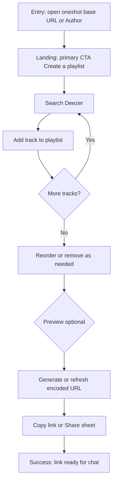
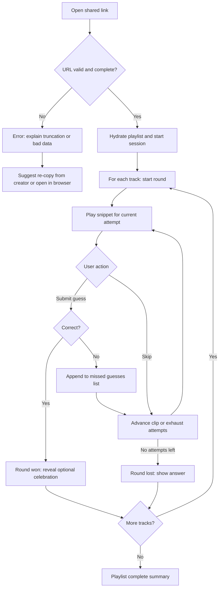
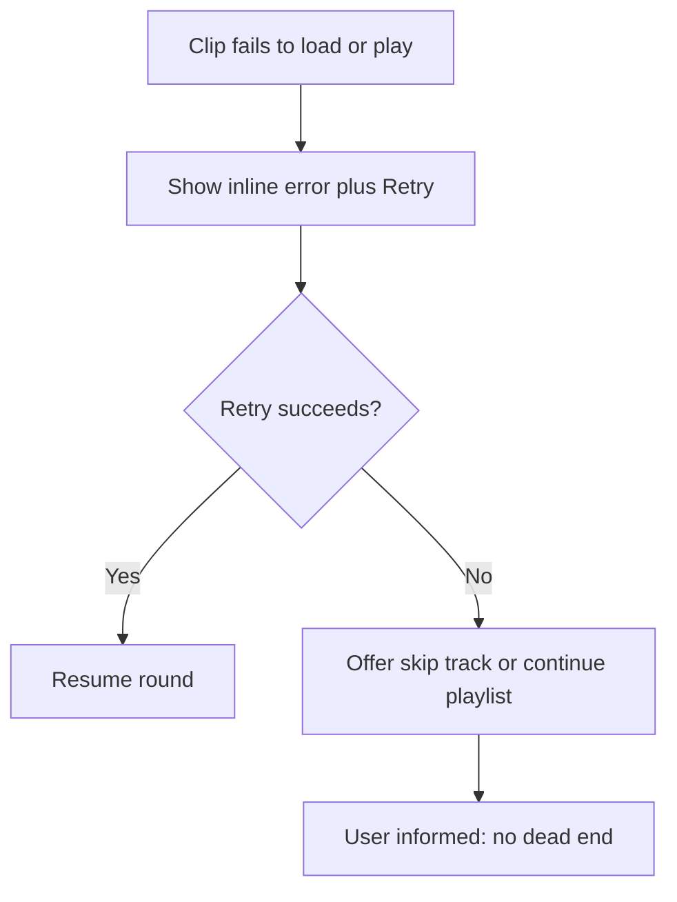
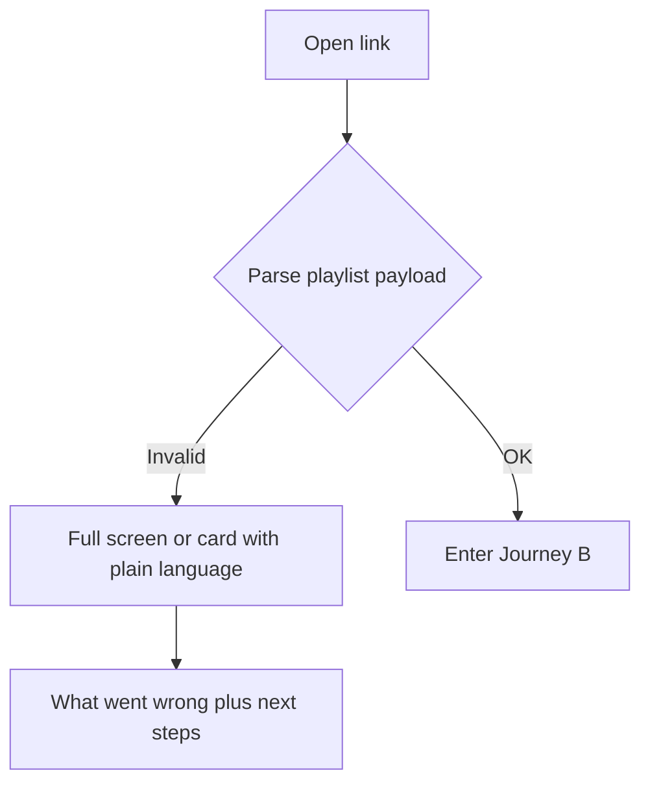

---
stepsCompleted:
  - 1
  - 2
  - 3
  - 4
  - 5
  - 6
  - 7
  - 8
  - 9
  - 10
  - 11
  - 12
  - 13
  - 14
lastStep: 14
uxDesignWorkflowCompleted: "2026-04-02"
inputDocuments:
  - _bmad-output/planning-artifacts/prd.md
---

# UX Design Specification oneshot

**Author:** Ryan
**Date:** April 2, 2026

---

<!-- UX design content will be appended sequentially through collaborative workflow steps -->

## Executive Summary

### Project Vision

Deliver a **frictionless, mobile-first** music guessing experience: **user-built Deezer playlists** become **shareable games**—each track is a **classic Heardle round** (progressive clips, six attempts, skip, catalog autocomplete)—with **no accounts** and **no music login**, so **one link** is enough to play in a real group chat.

### Target Users

- **Playlist creators** curate tracks for friends, **preview** order, **generate and copy** a URL, and may **iterate** the list and **reshare**—all without signing up.
- **Players** open a **shared link**, understand **round rules** quickly, and move through the **playlist** with **clear feedback** and **recoverable** errors when **network** or **catalog** fails.

### Key Design Challenges

- Balance **minimal chrome** with **always-readable** attempt state, round outcome, and playlist progress on **small touch screens**.
- Make **autocomplete selection** fast and **accessible** (touch, keyboard, screen readers) under **variable latency**.
- Design **trustworthy error paths** for **bad URLs** and **audio failures** (retry, skip track, plain language)—never **silent** failure.

### Design Opportunities

- **Immediate value**: Land users in **create** or **play** without gates; reinforce **“your playlist, your people”** in copy and hierarchy.
- **Root landing page**: Visitors who open the **app base URL** (no playlist in the link) get a **simple, modern, clean** **landing** with a **primary call to action** to **create a playlist**—the default path for **new creators**—plus **minimal** secondary paths as needed (e.g. **how it works** or **play** from a pasted link), **without** diluting the **main CTA**.
- **Visual tone**: **Simple**, **modern**, **clean**—**restrained** chrome, **clear** hierarchy, **generous** spacing; **contemporary** without **visual noise** or **trend-chasing** clutter.
- **Social-native sharing**: **Copy link** and system share patterns that feel at home in **messaging apps**.
- **Teach the loop once**: Short, dismissible **orientation** so **skip vs guess** and **attempt budget** match **Heardle expectations** without a tutorial wall.

## Core User Experience

### Defining Experience

**oneshot** centers on two intertwined loops:

1. **Play loop (recipient):** Enter from a **URL** → for each track, **hear progressive clips**, manage a **six-attempt budget**, use **skip** or **autocomplete guess**, get **immediate round feedback**, then **advance through the playlist** until the run ends.
2. **Create loop (creator):** **Search Deezer**, **build and reorder** a playlist, **preview** feel and order, then **produce a shareable URL** (copy/share) that encodes the same game for friends.

The experience must feel **instant and social**: **no accounts**, **no music login**, and **Heardle-familiar rules** communicated through **UI state and copy**, not a heavy tutorial.

### Platform Strategy

- **Mobile web app** (SPA), **browser-first**, **touch-optimized** layouts and targets; **desktop** usable for full flows with acceptable layout differences.
- **P0 browsers:** iOS Safari and Android Chrome (current −1); **HTTPS** delivery; **audio** and **Deezer API** are **online** dependencies for MVP—surface **loading** and **errors** instead of silent stalls.
- **URL as playlist carrier:** Entry from **shared links** must **parse**, **validate**, and **hydrate** gameplay; invalid or truncated data gets a **dedicated error state** with plain-language recovery hints.
- **PWA** is **post-MVP** per PRD; design **shell and safe areas** so a future install path does not require layout rewrites.

### Effortless Interactions

- **Landing (shared game link):** Recipient **never** sees auth; first meaningful screen is **play** or **clear failure** with next step.
- **Landing (app root / no playlist in URL):** A **dedicated** **landing page** presents **one** **primary** **CTA**: **create a playlist** (enter **authoring**). Layout stays **simple**, **modern**, and **clean**—**single** **visual** **focus** on that action; **no** **login** and **no** **competing** **primary** **buttons**.
- **Round clarity:** **Attempt index / remaining attempts** and **clip stage** are always scannable; **skip** and **wrong guess** both **consume one attempt** and **advance audio** with **non-ambiguous** feedback.
- **Guessing:** **Autocomplete/combobox** is the **primary** input—**fast to focus**, **tolerant of latency** (skeleton or inline status), **easy to correct** before submit.
- **Missed guesses (wrong answers):** Each **incorrect** **submitted** **pick** (**title** + **artist** from catalog) **stays visible** for the **current track** in a **dedicated list** (e.g. **“Not it”** / **“Already guessed”**)—**Heardle-style**—so players **never** **re-stumble** on the **same** **wrong** **song** **by** **accident** and can **see** **what** **they’ve** **ruled** **out**. **Clear** the **list** when the **round** **advances** to the **next** **playlist** **track** or **resolves**; **style** **muted** **(not** **error-red** **for** **normal** **gameplay**); **scroll** **internally** if **many** **rows** on **small** **screens**.
- **Sharing:** After authoring, **copy link** (and system share where available) is **one tap** from success; **URL length** concerns are handled **transparently** (e.g. warning if approaching limits) rather than surprising the user after share.
- **Recovery:** **Retry** for failed audio; **skip or continue** for unavailable tracks per product rules—**never** a stuck spinner with no copy.

### Critical Success Moments

- **Link open → first audible clip** (or **actionable error** within seconds): proves **“no signup”** and **technical trust**.
- **First resolved round** (win or loss with reveal): validates **Heardle loop** comprehension and **emotional payoff**.
- **Creator copies shareable URL** and imagines friends opening it: validates **social loop** closure.
- **Graceful degradation** on **bad link** or **Deezer hiccup**: separates **delight** from **abandonment**.

### Experience Principles

1. **Link-first, login-never** — Every screen and error should reinforce **open → play** without **identity friction**.
2. **Audio is the hero; UI is the legend** — **Minimal chrome** during play; **state** (attempt, stage, playlist position, **prior wrong guesses**) is **always legible** without competing with the **play/skip/guess** triad.
3. **Same rules, visible consequences** — **Skip** and **wrong guess** **feel** consistent with Heardle: **one attempt**, **next clip**, **no surprises**.
4. **Fail loud, recover fast** — **Network**, **catalog**, and **URL** issues get **explicit messaging** and **a next action** (retry, skip track, re-copy link).
5. **Mobile thumbs, desktop OK** — **Large targets**, **single-column** play; **authoring** can be **slightly denser** but not **desktop-only**.
6. **Simple, modern, clean** — **Uncluttered** surfaces, **consistent** spacing, **limited** decorative noise; the product should feel **calm** and **current**, with **clarity** over **ornament**.

## Desired Emotional Response

### Primary Emotional Goals

- **Effortless fun** — Users should feel they can **jump in from a link** and **play** without **cognitive overhead** or **account anxiety**.
- **Social spark** — **Creators** feel **proud and playful** sharing a list; **players** feel **in on the joke** (inside tracks, shared taste) rather than **alone in an app**.
- **Fair challenge** — Heardle-style rules feel **legible and fair**: **skip, guess, and attempts** produce **predictable** outcomes so **wins feel earned** and **losses feel honest**—not **rigged** or **opaque**.

### Emotional Journey Mapping

| Stage | Desired feelings | Notes |
|--------|------------------|--------|
| **Discover (open link)** | **Curiosity**, then **relief** (no sign-up wall) | First screen should **reward the tap**, not **demand identity**. |
| **Learn the loop** | **Light confidence** | Brief, dismissible cues so **rules** feel **obvious**, not **schoolish**. |
| **Core play (per track)** | **Absorption**, **playful tension**, **small bursts of delight** on right guesses | Audio is **central**; UI supports **flow** without **noise**. |
| **Round outcome** | **Triumph** (correct) or **resigned amusement** (loss with reveal)—not **humiliation** | Reveal copy should **celebrate** or **commiserate**, never **mock** the user. |
| **Playlist progress** | **Momentum** and **light competition with self** (nail the set) | Progress should feel **achievable**, not **endless**. |
| **Create / share** | **Creative agency**, **anticipation** of friends’ reactions | **Copy link** should feel like **closing the loop**, not **a chore**. |
| **Something goes wrong** | **Calm clarity** — **trusted** that the app **explains** and offers **next steps** | Avoid **shame**, **blame**, or **silent failure**. |
| **Return / repeat** | **Familiarity** and **low friction** to start another run or **tweak and resend** | **No account** makes **repeat** feel **natural**. |

### Micro-Emotions

- **Trust over skepticism** — Especially at **first open**; **no login** must be **obvious** in **layout**, not only **copy**.
- **Excitement over anxiety** — **Countdown of attempts** should feel **game-like**, not **punitive**; avoid **alarm** colors for **normal** wrong guesses.
- **Accomplishment over frustration** — **Autocomplete** and **skip** should **respond quickly** so users **blame the song**, not **the UI**.
- **Delight (optional)** — **Subtle** rewards: **clean transitions**, **satisfying** success feedback, **share moment** after **authoring**—**not** **gamified clutter** for MVP.
- **Connection over isolation** — **Microcopy** can nod to **“your playlist”** / **track X of Y** so **solo play** still feels **socially situated**.

### Design Implications

- **Relief** → **No** auth **screens**, **no** “connect Spotify” **dead ends**; **entry** is **play** or **clear error**.
- **Fair challenge** → **Persistent** attempt **readout**, **consistent** **skip/guess** **feedback**, **reveal** that **matches** Heardle **expectations**.
- **Social spark** → **Creator** path **surfaces** **playlist identity** and **share**; **player** path **surfaces** **progress** through **someone’s list**.
- **Trust on failure** → **Plain-language** errors, **visible** **retry/skip**, **no** **infinite spinners**; **invalid URL** states **explain** **truncation** / **bad data** without **tech jargon**.
- **Emotional safety** → **Tone** stays **friendly** and **compact**; **avoid** **shaming** wrong guesses; **loss** states **show answer** with **neutral-to-warm** tone.

### Emotional Design Principles

1. **Reward the tap** — The **first moments** after **opening a link** should **feel welcoming** and **immediately legible** as a **game**, not a **gate**.
2. **Clarity is kindness** — **Rules** and **errors** are **part of care**; **confusion** reads as **cold** or **cheap**.
3. **Intensity lives in audio** — **Visual** emotion is **supporting**: **calm** surface, **exciting** **sound** and **beat** of **rounds**.
4. **Social emotion without social features** — **No accounts** still allows **“for us”** framing via **copy** and **context** (playlist progress, share).
5. **Recover the vibe** — After **any** error, **next action** should **restore agency** so **users** stay **willing** to **retry** or **reshare**.

### Persona coverage (creator and player)

**Playlist creator** — Emotional goals emphasize **agency** (search → build → reorder → preview), **confidence** before share, and **no shame** if a link is **too long**, **truncated by a chat app**, or **needs a re-copy**. **Iterate and resend** should feel as **light** as the first share.

**Gameplay user** — Emotional goals emphasize **relief** at **no login**, **absorption** in rounds, **fair** feedback on **skip vs wrong guess**, and **calm recovery** when **audio** or **network** fails—so **friction** stays **in the puzzle**, not **in the UI**.

## UX Pattern Analysis & Inspiration

### Inspiring Products Analysis

| Reference | What works (UX) | Relevance to oneshot |
|-----------|-----------------|----------------------|
| **Heardle-style games** | **Progressive audio**, **fixed attempt ladder**, **skip** and **guess** tied to **same economy**, **reveal** on fail | **Core round loop**—match **mental model** and **timing clarity**. |
| **Music streaming apps** (search/list patterns) | **Fast search**, **clear track rows** (art, title, artist), **add** actions, **list reorder** | **Creator** path for **Deezer-backed** authoring. |
| **Share-native flows** (OS share sheet, **Copy link**) | **Single primary outcome** after success, **system-native** share | **Creator** “copy and drop in chat” **moment**. |
| **Minimal account-free games** | **URL in, play out**; **no** **profile** **wall** | **Player** **link-first** **promise**. |

### Transferable UX Patterns

**Navigation / structure**

- **Mode clarity** — Separate **author** vs **play** (or **deep link lands in play**) so users never **guess which mode** they’re in.
- **One primary action per phase** — During a round: **listen / skip / guess**; avoid **competing** **CTAs**.

**Interaction**

- **Combobox search-to-select** — Music apps and **tag pickers** show **debounced search**, **highlighted row**, **submit** on **selection**—fits **FR10** **autocomplete** guess.
- **Wrong-guess history** — Heardle-style **stack** of **rejected** **titles**; **oneshot** **mirrors** with **catalog** **metadata** **rows** **(not** **free-text** **only**).
- **Attempt / stage indicator** — **Heardle-like** **discrete steps** (e.g. **dots or segments**) for **1–6**—scannable at a glance.
- **Post-round beat** — Short **reveal** state, then **explicit** **next track** / **end**—avoids **accidental double-taps**.

**Visual / feedback**

- **Calm default, vivid success** — **Wrong** guess **informative** not **alarm**; **correct** **moment** carries **celebration** **without** **visual noise**.

**Creator-specific**

- **Playlist as ordered stack** — **Reorder** (drag or controls), **remove** **inline**, **empty state** that **teaches** **add tracks** before **share enables** (or **disabled share** with **reason**).

### Anti-Patterns to Avoid

- **Auth before value** — Any **sign-in** **before** **hearing a clip** or **seeing the playlist** **breaks** the **PRD** and **emotional** **relief** goal.
- **Free-text guess as default** — **Without** **catalog-backed** **selection**, **FR10** and **fairness** **suffer**.
- **Cryptic URL failures** — **Blank screen** or **console-level** errors on **bad/truncated** links (**Journey D**).
- **Silent audio failure** — **Spinner** with **no** **retry** or **copy** (**Journey C**).
- **Over-tutorialization** — **Long** **modals** **before** **first clip**; **prefer** **inline** **rules** and **dismissible** **hints**.

### Design Inspiration Strategy

**Adopt**

- **Heardle-style** **attempt** and **snippet** **progression** **metaphor** (labels, **remaining attempts**, **skip** **consequence**).
- **Music app**-like **search results** and **playlist** **editing** **density** on **author**, **stripped** on **play**.

**Adapt**

- **Single-player session** in **chat** — **Copy** **emphasis** over **in-app** **social** **graph**; **OG/preview** **post-MVP** per PRD.
- **Deezer constraints** — **Preview** **limits** and **errors** **designed** as **first-class** **states**, not **edge cases**.

**Avoid**

- **Account** **walls**, **connect** **streaming** **account** **inside** **oneshot**, **leaderboard** **pressure** **for** **MVP**—**conflict** with **scope** and **tone**.

**Uniqueness** — **User-authored** **playlists** **in** **URL** **is** the **differentiator**: **UX** should **celebrate** **“this list”** **not** **only** **anonymous** **daily** **puzzle** **energy**.

## Design System Foundation

### 1.1 Design System Choice

**Primary recommendation:** a **themeable, utility-first** foundation with **accessible headless primitives**:

- **Styling:** **Tailwind CSS** (or equivalent **utility layer**) for **responsive** layout, **spacing**, **typography**, and **design tokens** (colors, radii, motion).
- **Components:** **Radix UI**-style **unstyled primitives** (or **shadcn/ui** if the stack is **React**), chosen for **keyboard**, **focus**, **screen-reader**, and **combobox** patterns that map to **guess entry** and **dialogs**.

**Acceptable alternative (faster default UI, less differentiation):** **MUI** or **Chakra UI** on the chosen framework, with a **custom theme** to **soften** density and **mobile-tune** components.

**Not recommended for MVP:** a **from-scratch** component set with **no** accessibility baseline—**risk** to **NFR-A1** and **schedule**.

### Rationale for Selection

- **Accessibility** — PRD targets **WCAG 2.1 AA** on **authoring**, **play**, and **autocomplete**; **Radix-class** primitives reduce **regression risk** on **focus management** and **combobox** behavior.
- **Mobile-first** — **Utility layout** plus **tokenized** **tap targets** and **safe-area** spacing align with **P0** **browser** matrix.
- **Velocity** — **Greenfield** and **experience MVP** favor **composition** over **inventing** every **pattern**; **Tailwind + headless** (or **one** **mature** **React** kit) matches **PRD** **resource** assumptions.
- **Uniqueness** — **Visual differentiation** comes from **brand tokens**, **motion**, and **game** **chrome** (attempt UI, audio-forward layout), not from **rebuilding** **buttons** from **atoms**.

### Implementation Approach

1. **Lock tokens first** — **Color** (incl. **non-color-only** **states**), **type scale**, **radius**, **elevation**, **motion** duration—**documented** as **CSS variables** or **Tailwind theme** extension.
2. **Map primitives to flows** — **Combobox** (guess), **Button** (skip, primary actions), **List** (playlist, search results), **Toast/inline alert** (errors), **Progress** (playlist / optional round progress).
3. **Framework bind** — When the repo **chooses** **React / Vue / Svelte**, **re-evaluate** **one** line: **Radix + shadcn-style** vs **MUI/Chakra** vs **Skeleton + Radix**—**same** **token** layer either way.
4. **Performance** — **Tree-shake** UI imports; **lazy** **non-critical** **author** panels if **play** path is **critical** for **first load**.

### Customization Strategy

- **Brand** — **Dark-first or light-first** **single** **clear** **direction** for **game** **feel**; **avoid** **neon-on-neon**; **reserve** **strong** **accent** for **success** / **round resolve**.
- **Game layer** — **Custom** **components** where **libraries** **don’t** fit: **attempt ladder**, **clip-stage** **indicator**, **round** **reveal**—built **on top of** **tokens** + **primitives**.
- **Density** — **Author** **screens** may use **slightly** **tighter** **lists**; **play** **remains** **one-column**, **large** **controls**—**one** **token** set, **mode-specific** **spacing** **variants** if needed.

## 2. Core User Experience

### 2.1 Defining Experience

The defining experience for **oneshot** is **dual but one product promise**:

1. **Player:** **“Open a link → hear progressive clips → pick the right song from catalog suggestions (or skip) within six attempts → move through someone’s playlist.”** If this loop feels **fair, legible, and fast**, the product wins.
2. **Creator:** **“Search tracks → order a list → copy one URL that *is* the game.”** If **authoring** feels **lighter than explaining the rules in chat**, creators keep **shipping** new lists.

**One line:** **Your playlist is the puzzle; one link carries the whole session—no accounts.**

### 2.2 User Mental Model

- **Players** arrive with **Heardle** or **song-guessing** expectations: **longer clips** = **spent attempts**, **skip** = **cost**, **reveal** at **fail**. They may **fear** **sign-up**—the UI must **confirm** **open-and-play** in **seconds**.
- **Creators** think in **playlist + share** terms (Spotify/Deezer habits), not **“host a game server.”** They expect **search**, **reorder**, **preview**, then **paste a link**—same as **sharing a playlist**, but the **URL** must **encode** **full game state**.
- **Confusion risks:** **Skip vs wrong guess** (same attempt cost)—must **read identically** in **feedback**; **bad/truncated links**—must **not** look like **bugs**; **Deezer** hiccups—users **blame network or rights**, not **mystery**—so **copy** must **explain**.

### 2.3 Success Criteria

- **Player:** Within **one track**, a user can **state** how many **attempts** remain, what **clip stage** they’re on, and **which songs they already guessed wrong** **without** hunting the UI.
- **Player:** **First meaningful audio** (or **clear error**) within **PRD timing** expectations after **open** or **action**.
- **Player:** **Correct** guess produces **immediate** **success** end to round; **wrong/skip** produces **immediate** **advance**—**no** **double-tap** ambiguity.
- **Creator:** **Empty playlist** → **cannot share** (or **disabled** share) with **obvious** **why**; **non-empty** → **copy/share** is **one** **obvious** **path**.
- **Both:** **No screen** asks for **app account** or **music login** for these outcomes.

### 2.4 Novel UX Patterns

- **Established:** **Heardle-like** **round** **structure**, **music search** **rows**, **combobox** **guess**, **share sheet** / **copy link**.
- **Novel twist:** **Playlist-as-game-object** **serialized** in **URL**—users may **not** realize **length limits** or **chat truncation**; **errors** and **warnings** are **part** of **pattern education**, not **edge** polish only.
- **Teaching:** **Reuse** **Heardle** **literacy** for **round**; use **short** **inline** copy for **“this link *is* the game”** and **URL** **hygiene** where needed.

### 2.5 Experience Mechanics

**Player — round loop**

1. **Initiation:** **Deep link** loads **playlist**; **first unresolved** track **starts** **round** (or **explicit** **start** if PRD requires).
2. **Interaction:** **Audio** plays **current** **snippet**; user **skips** (consumes attempt, **next** snippet) or **selects** from **autocomplete** (submit guess).
3. **Feedback:** **Wrong** → **append** **guess** to **missed-guesses** **list** (title + artist), **attempt** decrements, **next** snippet **plays**; **correct** → **win**; **no attempts** → **lose** + **reveal**. **Skip** → **no** **missed-guess** **row** (only **wrong** **submissions** **appear** **there**).
4. **Completion:** **Next track** or **playlist** **complete** summary.

**Creator — publish loop**

1. **Initiation:** **Open** app **to** **author** (or **mode** switch).
2. **Interaction:** **Search** → **add**; **reorder**/**remove**; optional **preview** per PRD.
3. **Feedback:** **Playlist** **length** / **URL** **warnings** **before** **share**; **errors** from **catalog** **inline**.
4. **Completion:** **Copy** or **system share** of **encoded** URL; **confirmation** **optional** (e.g. **“link copied”**).

**Shared**

- **Errors** always offer **next** **action** (**retry**, **re-copy**, **skip** track).

## Visual Design Foundation

### Color System

**Direction:** **Dark-first UI** as default for **play** (reduces glare, fits **night/casual** mobile use, lets **album/cover** art pop). **Author** may share the same shell or use a **slightly** **lighter** **surface** for **list** **scanning**—decide at implementation; **tokens** support **both**.

**Semantic mapping (conceptual):**

| Token role | Use |
|------------|-----|
| **Background / surface** | **Page** and **card** layers; **subtle** **contrast** between **chrome** and **content**. |
| **Primary** | **Primary** **CTAs**: **Skip**, **Submit guess**, **Add track**, **Copy link**, **Create a playlist** (landing). |
| **Secondary** | **Quiet** actions: **Back**, **dismiss**, **secondary** **controls**. |
| **Success** | **Correct** guess, **round** **won**. |
| **Warning** | **URL** **length** approaching limit, **non-blocking** cautions. |
| **Error** | **Playback** failure, **invalid** link, **catalog** errors. |
| **Muted** | **Hints**, **metadata**, **attempt** **labels**. |

**Rules**

- **Wrong guess** / **normal** **negative** **progress**: **informative** (muted or **cool** **accent**), **not** **alarm red** for **expected** **gameplay**.
- **Reserve** **saturated** **success** for **win** moments; **lose** **reveal** uses **neutral** + **clear** **typography**, not **punitive** **red** **floods**.
- **Contrast:** **Body** and **interactive** **text** target **WCAG** **AA** **on** **chosen** **surfaces**; **verify** **pairs** in **implementation**.

### Typography System

**Tone:** **Friendly**, **modern**, **readable** at arm’s length on **phone**—aligned with **simple**, **clean** UI (not **corporate** **dense**).

**Strategy**

- **Primary:** **System UI stack** (`system-ui`, **SF Pro** on iOS, **Roboto** on Android) or **one** **web** **neutral** (**Inter**, **Geist**) for **cross-browser** **consistency**—**fewer** **FOIT** **issues** on **mobile**.
- **Optional display:** **Single** **weight** for **wordmark** / **hero** **“oneshot”** only—**avoid** **multiple** **display** **faces**.

**Scale (indicative)**

- **Round title / track context:** **Largest** **mobile** **readable** **line** (e.g. **~20–24px** **equivalent**).
- **Body / guess field:** **≥16px** **minimum** for **inputs** ( **iOS** **zoom** **avoidance** ).
- **Metadata** (artist line, attempt **helper**): **one** **step** **down** from **body**, **muted** **color** **not** **tiny** **size** **alone**.

**Line height:** **Comfortable** for **short** **strings** (**1.4–1.5** **body**); **tighter** **only** for **single-line** **labels**.

### Spacing & Layout Foundation

**Unit:** **4px** **base** (Tailwind-style **0.25rem** **grid**); **touch** **targets** **minimum** **44×44px** **where** **interactive**.

**Layout**

- **Landing (root):** **Hero** **message** + **single** **primary** **CTA** (**Create a playlist**); **ample** **whitespace**, **no** **dense** **marketing** **grids** for **MVP**—**simple**, **modern**, **clean**.
- **Play:** **Single** **column**, **max-width** **~480–600px** **centered** on **large** **phones** / **desktop**; **generous** **vertical** **rhythm** **between** **attempt** **dots**, **snippet** **progress**, **missed-guesses** **list**, **guess** **field**, **Skip**.
- **Author:** **Same** **column**; **lists** may use **slightly** **tighter** **vertical** **gaps** **between** **rows**; **sticky** **share** **bar** **optional** on **long** **playlists**.

**Principles**

1. **Breathing room** around **audio** and **primary** **CTAs**—**avoid** **crowding** **the** **guess** **row**.
2. **Consistent** **edge** **padding** (**16px** **minimum** **horizontal** on **narrow** **viewports**).
3. **Safe** **areas:** **respect** **notch** / **home** **indicator** **insets** on **supported** **browsers**.

### Accessibility Considerations

- **WCAG 2.1 Level AA** for **core** **flows** (PRD / NFR-A1): **contrast**, **touch** **targets**, **focus** **visibility** **where** **keyboard** **used**.
- **State** **without** **color** **alone:** **Correct** / **wrong** / **skip** use **text**, **icons**, or **motion** **in** **addition** to **hue**.
- **Focus** **order:** **Guess** **combobox** → **Skip** → **secondary** **actions** **logical** for **keyboard** **and** **SR**.
- **Audio** **is** **not** **the** **only** **channel:** **reveal** **shows** **title** / **artist** **visually**; **errors** **are** **readable** **text**, **not** **beeps** **alone**.

## Design Direction Decision

### Design directions explored

Reference: `_bmad-output/planning-artifacts/ux-design-directions.html` — eight play directions (D1–D8), plus **four authoring** directions (**A1–A4**) inspired by **Spotify** and **Apple Music** playlist flows.

### Chosen direction — play (D1 + D6 hybrid)

- **Landing:** Keep **Direction 1** — **dark minimal**, **neutral** high-contrast **Create a playlist** CTA, **simple** hero copy.
- **Play:** Keep **Direction 1** **interaction** patterns — **six-dot** attempt ladder, **autocomplete** guess field, **Skip** as **secondary** control, plus a **visible** **missed-guesses** **list** **(wrong** **picks)** **between** **progress** **bar** **and** **guess** **field** **(see** **`ux-design-directions.html`** **hybrid** **mock)**.
- **From Direction 6:** **Cyan → violet** **gradient** **accent** on **playback progress** (not on every UI control—**reserve** for **time-in-clip** feedback).
- **Heardle-style clip progress:**
  - **Single** **linear** **progress bar** for the **current snippet** only, with **elapsed** time and **end** time for **this clip** (e.g. **0:02** / **0:04**) — **no** **circular** **ring**. **Duration** matches the **active** **attempt’s** **clip length** (PRD schedule **1s / 2s / 4s / 7s / 11s / 16s**).
  - **Attempt** **index** **1–6** stays on the **existing** **dot** **ladder** (Direction 1)—**do not** **duplicate** on a **ring**.

### Chosen direction — authoring (mix of A1–A4)

Pick **per-screen** or **unify**:

| ID | Inspiration | Use for |
|----|-------------|---------|
| **A1** | **Spotify** — dark **#121212**, **search** bar, **green** circular **+** add, **“Your game”** strip + **Copy link** | **Primary** **search-to-playlist** **flow** |
| **A2** | **Apple Music** — **light**, **Cancel / Done**, **Add songs** row, **large** **art** rows | **Alternative** **light** **author** **skin** or **sheet** **modality** |
| **A3** | **Spotify** — **filter chips**, **drag** **handles** (**⋮⋮**), **reorder** | **Edit order** **mode** |
| **A4** | **Apple** — **grouped** **list**, **grab** **handle**, **Add songs** **header** | **Settings** **+** **track** **list** **combined** **sheet** |

**Default recommendation:** **A1** for **happy-path** **build + share**; **A3** when **reorder** is **emphasized**; borrow **A2/A4** **patterns** for **modals** / **iOS** **users** if **needed**.

### Design rationale

- **D1** delivers **simple / modern / clean** and **clear** **root** **CTA**; **D6** adds **gradient** **playback** **progress** on the **bar** only—**no** **extra** **ring** **chrome**.
- **Bar** + **elapsed / clip end** times match **Heardle**-style **“how** **much** **of** **this** **snippet** **is** **left**?” **expectations**; **dots** **carry** **attempt** **count**.
- **Spotify** / **Apple** **author** **mocks** **reduce** **invention** **risk** on **search**, **add**, **reorder**, **share**—**behaviors** **users** **already** **know**.

### Implementation approach

- **Tokens:** Map **snippet** **progress** **colors** to **existing** **gradient** (**cyan** / **violet**); keep **wrong** **guess** **muted** per **Visual** **Foundation**.
- **Accessibility:** **Progress** **bar** **exposes** **time** **for** **SR**; **missed-guesses** **use** **a** **list** **semantic** **with** **per-row** **text**; **avoid** **noisy** **live** **region** **updates**—**optional** **single** **polite** **announcement** **when** **a** **wrong** **guess** **is** **added**.
- **Author** **UI:** **Implement** **one** **consistent** **shell** (dark **A1**-like **recommended**); **reuse** **components** **across** **A3** **reorder** **without** **shipping** **four** **full** **themes** for **MVP**.

## User Journey Flows

Flows build on **PRD** journeys (Maya creator, Jordan player, edge cases) and current UX decisions: **root landing** + **D1+D6 play** (snippet bar, **missed guesses**), **no login**.

### Journey A — Creator: build playlist and share

**Goal:** Assemble a **Deezer-backed** playlist, **copy a shareable URL**, drop it in chat—**no accounts**.

**Flow summary:** Land on **app root** (or **author** entry) → **search/add/reorder** → **optional preview** → **copy or system share** → **confirm** (e.g. link copied).

**Notes:** **Empty playlist** blocks or **disables** share with **inline** **why**. **URL length** warnings **before** share if approaching limits.

### Journey B — Player: open link and play playlist

**Goal:** Open **shared URL**, play **Heardle-style rounds** per track, **finish playlist**—**no signup**.

**Flow summary:** **Parse URL** → **hydrate** playlist → **for each track:** **progressive clips** → **guess** (autocomplete) or **skip** → **wrong** guesses **append** to **missed list** → **win/lose** → **next track** or **end**.

**Notes:** **Skip** does **not** add a **missed-guess** **row**. **Snippet bar** shows **elapsed / clip end** for **current clip** only.

### Journey C — Recovery: playback or catalog failure mid-session

**Goal:** **Never** **silent** **hang**; **recover** or **skip** **per** **PRD** **FR27–FR29**.

### Journey D — Recovery: invalid or truncated share link

**Goal:** **Understandable** **failure**—**not** **blank** **shell** (**FR24**, **Journey D** in PRD).

### Journey patterns

- **Entry:** **Deep link** **vs** **root** **landing**—**two** **clear** **modes**; **no** **auth** **gate** **either** **path**.
- **Progress:** **Primary** **CTA** **one** **per** **phase** (**copy link** **after** **build**; **guess** **or** **skip** **during** **round**).
- **Feedback:** **Inline** **lists** **for** **wrong** **guesses**; **toast** **or** **banner** **optional** **for** **copy** **success** **only**.
- **Errors:** **Recover** **action** **on** **same** **screen** **when** **possible** (**Retry**, **Skip** **track**, **re-copy** **link**).

### Flow optimization principles

1. **Shortest path to first value** — **Player:** **first** **audible** **clip** **or** **clear** **error** **fast**; **Creator:** **first** **added** **track** **before** **long** **onboarding**.
2. **Cognitive load** — **One** **decision** **at** **a** **time** **in** **round** (**listen** **then** **act**); **author** **search** **stays** **focused** **without** **modal** **stack** **for** **MVP** **unless** **needed**.
3. **Consistent recovery** — **Same** **error** **pattern** **(message, action, optional dismiss)** **across** **URL**, **audio**, **catalog**.
4. **Respect Heardle literacy** — **Dots**, **missed** **list**, **snippet** **timer** **reinforce** **rules** **without** **a** **tutorial** **wall**.

## Component Strategy

### Design system components

Use **off-the-shelf** **primitives** for **accessibility** and **speed**:

- **Button** — primary (**Create a playlist**, **Copy link**), secondary (**Skip**, **Back**), ghost (**Cancel**).
- **Combobox / Command** — **guess** entry with **async** **search** **against** **Deezer**.
- **Text input** — **playlist** **name** **optional**; **search** **field** **in** **author**.
- **List / scroll area** — **search** **results**, **playlist** **tracks**, **missed** **guesses**.
- **Dialog or drawer** — **errors** **that** **need** **focus** **trap**; **optional** **preview** **round**.
- **Toast / inline alert** — **link** **copied**, **non-blocking** **catalog** **warnings**.
- **Progress** — **linear** **snippet** **bar** (**role=progressbar**, **aria-valuenow** / **max**).

### Custom components

| Component | Purpose | Notes |
|-----------|---------|--------|
| **AttemptLadder** | **Six** **dots** **or** **segments** **for** **attempts** **1–6** | **States:** **used** / **current** / **remaining**; **never** **only** **color** **for** **state**. |
| **SnippetProgressBar** | **Elapsed** / **duration** **for** **current** **clip** | **Gradient** **(D6)** **on** **fill**; **sync** **to** **audio** **clock**. |
| **MissedGuessesList** | **Stack** **of** **wrong** **picks** **(title** **+** **artist)** | **Append-only** **per** **round**; **scroll** **max-height** **on** **mobile**. |
| **PlaylistRow** | **Single** **track** **line** **in** **author** **(art** **optional,** **title,** **artist,** **add/remove/reorder)** | **Variants:** **search** **result** **vs** **playlist** **item** **(drag** **handle** **for** **A3).** |
| **ShareLinkBar** | **Sticky** **or** **inline** **Copy** **+** **optional** **Share** | **Disabled** **when** **empty** **playlist**; **URL** **length** **warning**. |
| **GameShell** | **Layout** **wrapper** **for** **play** **(dots** **+** **bar** **+** **missed** **+** **guess** **+** **skip)** | **Single** **column** **max-width**; **safe** **areas**. |

### Component implementation strategy

- **Compose** **custom** **pieces** **from** **tokens** **+** **primitives**; **avoid** **forking** **Radix** **behavior** **for** **guess** **combobox**.
- **Single** **author** **shell** **(A1-leaning)** **reuse** **PlaylistRow** **everywhere** **tracks** **appear**.
- **Storybook** **or** **equivalent** **for** **AttemptLadder**, **SnippetProgressBar**, **MissedGuessesList** **with** **audio** **mock** **timers**.

### Implementation roadmap

**Phase 1 — Ship play path**

1. **GameShell** + **AttemptLadder** + **SnippetProgressBar** + **MissedGuessesList** + **guess** **Combobox**
2. **Skip** **+** **round** **resolve** **(win/lose/reveal)** **+** **playlist** **progress**

**Phase 2 — Author path**

3. **Search** **+** **PlaylistRow** **(add)** **+** **reorder** **(optional** **Phase** **2** **if** **MVP** **needs** **it)**
4. **ShareLinkBar** **+** **encode** **URL**

**Phase 3 — Harden**

5. **Error** **states** **(full** **screen** **+** **inline)** **unified**
6. **A11y** **pass** **on** **combobox** **+** **progress** **+** **missed** **list**

## UX Consistency Patterns

### Button hierarchy

| Level | Use | Examples |
|-------|-----|----------|
| **Primary** | **One** **main** **action** **per** **screen** **or** **sticky** **region** | **Create a playlist** (landing), **Copy link** (author when list non-empty), **Submit** **guess** (when combobox has selection—often **same** as **confirm** **pick**) |
| **Secondary** | **Safe** **alternate** **that** **does** **not** **end** **session** | **Skip**, **Back** **to** **playlist** **edit** |
| **Tertiary / ghost** | **Low** **emphasis** | **Cancel**, **dismiss** **hint** |

**Rules:** **Never** **two** **filled** **primaries** **competing** **in** **one** **viewport** **during** **play**. **Destructive** **is** **not** **central** **for** **MVP**; **remove** **track** **uses** **secondary** **or** **icon** **with** **confirm** **if** **needed**.

### Feedback patterns

| Type | When | Treatment |
|------|------|-------------|
| **Success** | **Correct** **guess**, **link** **copied**, **track** **added** | **Brief** **confirmation** **(toast** **or** **inline)**; **success** **color** **only** **for** **win** **/** **copy**—**not** **for** **every** **add** **to** **playlist** **if** **too** **noisy** |
| **Neutral / info** | **Skip**, **next** **clip** | **Inline** **state** **change** **on** **dots** **+** **bar**; **optional** **subtle** **motion** |
| **Wrong guess** | **Incorrect** **autocomplete** **submit** | **Append** **to** **missed** **list**—**muted** **styling**, **not** **error** **red** |
| **Warning** | **URL** **near** **length** **limit**, **rate** **limit** **soft** | **Inline** **banner** **below** **share** **or** **search** |
| **Error** | **Invalid** **URL**, **audio** **fail**, **catalog** **down** | **Icon** **+** **short** **title** **+** **body** **+** **primary** **recovery** **(Retry** **/** **Skip** **track** **/** **re-copy)** |

### Form patterns

- **Guess** **field:** **Combobox** **only**—**debounced** **search**, **keyboard** **↑↓** **to** **highlight**, **Enter** **to** **submit** **selection**; **no** **free-text** **score** **without** **catalog** **row**.
- **Author** **search:** **Same** **combobox** **pattern** **with** **add** **affordance** **on** **row**.
- **Validation:** **Inline** **under** **field** **or** **on** **submit**; **never** **block** **with** **modal** **for** **guess** **validation**—**invalid** **selection** **prevented** **by** **catalog** **IDs**.

### Navigation patterns

- **Play** **session:** **Linear** **(track** **1→n)** **with** **explicit** **next** **after** **round** **resolve**; **no** **sidebar**.
- **Author:** **Simple** **stack** **(list** **→** **optional** **edit** **order)** **or** **single** **scroll** **with** **sticky** **share** **bar** **at** **bottom**.
- **Entry:** **Deep** **link** **→** **play** **shell** **directly**; **root** **→** **landing** **→** **author** **route**.

### Additional patterns

**Loading**

- **Skeleton** **for** **search** **results** **and** **initial** **clip** **buffer**; **snippet** **bar** **can** **idle** **at** **0%** **until** **playback** **starts**.

**Empty**

- **No** **tracks** **in** **playlist:** **illustration** **optional**; **copy** **+** **focus** **search**.
- **No** **search** **results:** **“No** **matches”** **+** **retry** **query**.

**Overlays**

- **Prefer** **inline** **and** **bottom** **sheets** **on** **mobile** **over** **center** **modals** **except** **for** **blocking** **errors** **that** **need** **full** **attention**.

**Copy / share**

- **After** **Copy** **link:** **toast** **“Link** **copied”** **or** **inline** **check** **+** **2s** **revert**; **system** **Share** **when** **available**.

## Responsive Design & Accessibility

### Responsive strategy

- **Mobile-first (primary):** **Single-column** **layouts**, **touch-first** **targets**, **sticky** **share** **bar** **or** **thumb-zone** **actions** **where** **specified** **in** **component** **strategy**. **Play** **shell** **max-width** **~480–600px** **centered** **on** **large** **screens** **so** **desktop** **does** **not** **sprawl**.
- **Tablet:** **Same** **as** **mobile** **unless** **testing** **shows** **extra** **horizontal** **space** **helps**—**optional** **wider** **reading** **measure** **for** **author** **lists** **only**.
- **Desktop:** **No** **new** **navigation** **paradigm** **for** **MVP**; **use** **extra** **width** **for** **comfortable** **margins** **and** **optional** **two-column** **author** **(search** **|** **playlist)** **only** **if** **scope** **allows**—**not** **required** **for** **launch**.

### Breakpoint strategy

- **Default** **tiers:** **&lt;** **640px** **(phones** **primary),** **640px–1023px** **(large** **phone** **/** **small** **tablet),** **1024px+** **(desktop** **smoke** **/** **authoring).**
- **Implement** **with** **mobile-first** **min-width** **media** **queries**; **tokens** **for** **spacing** **not** **ad-hoc** **pixel** **jumps**.

### Accessibility strategy

- **Target:** **WCAG** **2.1** **Level** **AA** **on** **core** **flows** **(PRD** **NFR-A1)** — **match** **earlier** **Visual** **Foundation** **and** **component** **notes**.
- **Contrast:** **Normal** **text** **≥** **4.5:1** **vs** **background**; **large** **text** **/** **UI** **components** **per** **AA** **tables**; **wrong-guess** **/** **muted** **rows** **still** **meet** **contrast** **or** **use** **borders** **/** **icons** **not** **only** **gray** **on** **gray**.
- **Keyboard:** **Logical** **tab** **order** **on** **play:** **guess** **combobox** **→** **Skip** **→** **primary** **post-round** **actions**; **author:** **search** **→** **results** **→** **playlist** **→** **share**.
- **Screen** **readers:** **Semantic** **regions** **(main,** **nav** **if** **present)**; **progressbar** **for** **snippet** **bar**; **list** **/** **listitem** **for** **missed** **guesses**; **live** **regions** **sparingly** **(optional** **polite** **on** **wrong** **guess** **append)**.
- **Touch:** **Minimum** **44×44px** **hit** **areas** **for** **Skip,** **add,** **copy** **(padding** **counts)**.
- **Motion:** **Respect** **prefers-reduced-motion** **for** **non-essential** **animations** **(success** **pulse,** **transitions)**.

### Testing strategy

- **Responsive:** **Manual** **on** **iOS** **Safari** **and** **Android** **Chrome** **(P0)**; **spot-check** **desktop** **Chrome** **/** **Safari** **for** **author** **and** **share**.
- **Accessibility:** **axe** **or** **Lighthouse** **on** **CI** **for** **regressions**; **manual** **keyboard** **pass** **each** **release**; **VoiceOver** **(iOS)** **+** **one** **desktop** **SR** **(e.g.** **NVDA)** **on** **guess** **+** **round** **resolve** **path**.
- **Performance:** **Align** **with** **PRD** **NFR-P1** **/** **P2** **for** **first** **interaction** **and** **post-tap** **feedback**.

### Implementation guidelines

- **Prefer** **rem** **/** **%** **for** **layout** **and** **type**; **safe-area** **inset** **env()** **for** **notch** **/** **home** **indicator**.
- **Focus** **visible** **on** **all** **interactive** **elements** **(custom** **outline** **using** **tokens)**.
- **Do** **not** **disable** **zoom** **(avoid** **font-size** **&lt;** **16px** **on** **inputs)**.
- **Audio** **is** **supplementary** **to** **text** **for** **outcomes** **(reveal** **always** **shows** **title** **+** **artist** **visually)**.
